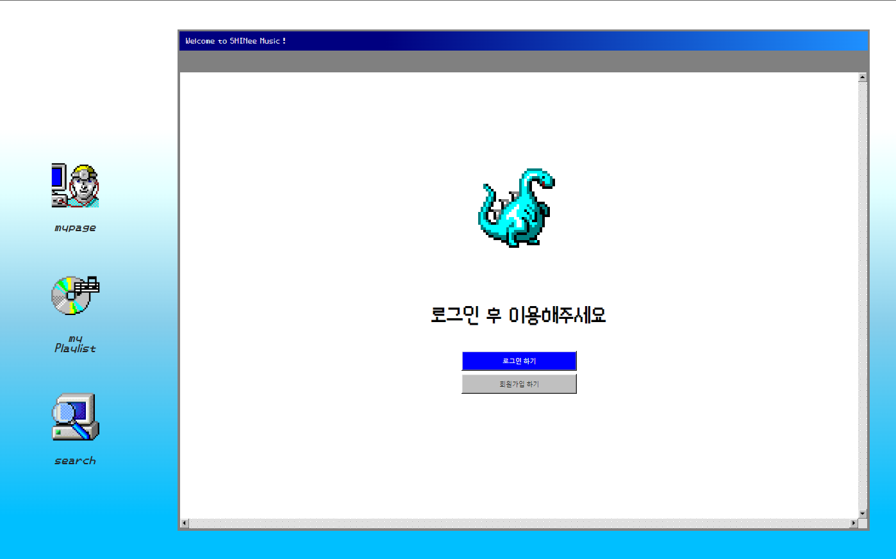

### README 
# SHINee Music

   
  이미지는 추후에 변경하시거나 삭제하시면 됩니다.  보통 메인 이미지를 올려놓습니다. 
  
   

## 프로젝트 소개

   TOP100, 인기차트 등 순위 매기기 음악 사이트는 이제 가라!
   YOUTUBE를 강타한 채널, 에센셜(essential;), 떼껄룩(TAKE A LOOK) 등등 본인이 테마에 맞게 제작한 플레이리스트를 공유할 수 있는 사이트가 있다면?
   자신만의 개성으로 플레이리스트를 만들고, 취향을 공유하며 소통해보자!

여러분이 만든 프로젝트를 캡쳐하거나 <strong>GIF</strong> 화면으로 만들어  
상대방이 프로젝트를 예시로 한 번에 볼수 있게 만들어주는게 좋습니다. 
또는 배포하여 프로젝트 사이트를 올려도 좋습니다. 
<strong>GIF</strong> 또는 <strong>Images</strong>

 

## 기술 스택

| JavaScript |    Java    | 
| :--------: | :--------: | 
|   ![js]    |  ![java]   |

 

## 구현 기능

### 기능 1

### 기능 2

### 기능 3

### 기능 4

 

## 배운 점 & 아쉬운 점

여러분이 프로젝트를 진행하며 배운 부분과 에러해결(trouble shooting)을 작성해서 기술하면 좋습니다. 
트러블슈팅(trouble shooting) : 문제 해결의 일종 / 보통 컴퓨터 시스템에서 발생하는 문제들을 해결하는 용어로 많이 사용합니다.

아쉬운점 12/13 해결해야 할 점
중복된 코드 재사용성으로 변경해서 코드 정렬
MVC : DTO DAO
 

<!-- Stack Icon Refernces -->

[js]: ./readme-static/img/javascript.svg
[java]: ./readme-static/img/java.svg
